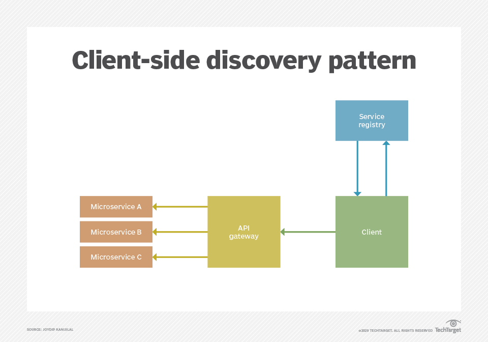

# Contents
[Common Annotations](#Annotations) | [Microservice vs service oriented architectures (SOA)](#Microservice-vs-service-oriented-architectures-SOA) |
[Profile](#Profile) | [Spring Cloud Config Server](#Spring-cloud-config-server) | [RestTemplate](#RestTemplate) | [WebClient](#WebClient) | [Service Discovery](#Service-Discovery) | 
[Issues With Microservices](#Issues) | [Hystrix](#Hystrix) | [BulkHead Pattern](#BulkHead-Pattern) | [Virtual vs Platform Threads](#Virtual-vs-Platform-Threads) | 
[Spring Security](#Spring-Security) | [Multi data source](Multi-data-source) | [Spring Caching](#Spring-Caching) | [PACT](#PACT) | [CDC](#CDC) | [Exceptions](#Exceptions-Handling) | 
[Request Validation](#Request-Validation) | [Custom HTTP Status](#Custom-HTTP-Status)

## Annotations
- @SpringBootApplication
    - @Configuration + @EnableAutoConfiguration + @ComponentScan
- @Component
    - if a class doesn't fit into controller, Repo or service we can mark with this to be managed by spring
- @Service
- @Repository
- @Controller
    - returns view
- @REstController
    - @Controller + @ResponseBody
    - Returns http response
- @RequestMapping("/api")
- In case of query param
	- @GetMapping("/users")
	    - (@RequestParam String name)
	    - (@RequestParam(required = false, defaultValue = "Guest") String name)
- In case of path param
	- @GetMapping("/users/{id}")
    	- public String getUserById(@PathVariable int id)
- @PostMapping("user")
    - (@RequestBody User user){}
- @Entity
    - @Id
    - @GeneratedValue(strategy = GenerationType.IDENTITY)
- @Value
  - @Value("${my.name}")
  - @Value("${my.name: default value}")
  - @Value("some static message") private String str;
  - @Value("${my.values}") private List<String>listValue
- @ConfigurationProperties("db") // anything starting with db like db.host, db.name 
  will be assigned to respective property of the class
- @SpringBootTest integration testing and it sets the spring context
- @MockBean create a fake bean during unit testing
- @Transactional
- Acync operation
	- add @Async on method
	- @EnableAsync by adding in config class
- @Qualifier("beanName") to mark which bean to inject
    - When you have multiple beans of the same type.
    - Often used in multi-implementation scenarios
    - When you want fine-grained control over which bean to inject.
    - @Primary on one bean to make it as default injection
## Microservice-vs-service-oriented-architectures-SOA
SOA is an older architecture style where services are typically larger, coarse-grained, and rely on a central Enterprise Service Bus (ESB) for communication and orchestration. This often leads to bottlenecks and tighter coupling.

Microservices take the concept further by breaking applications into smaller, fine-grained services, each owning its data and deployed independently. They communicate using lightweight protocols (REST, gRPC, messaging) and are decentralized.

SOA is more suitable for legacy, enterprise-wide integration, while microservices are designed for cloud-native, scalable, CI/CD-friendly systems.

In short: SOA = centralized, coarse-grained, ESB-driven; Microservices = decentralized, fine-grained, independently deployable.
## Profile
- Default profile is always active
- Naming
  - application-<profile name>.extn
- In prop file, Add
  - spring.profile.active: profile name
- We can also select which bean to load during startup 
  - @Profile("profile name") 
## Spring-cloud-config-server
- Create a Spring project with dependency 
  - spring-cloud-config-server
- Add 
  - @EnableConfigServer to main class
- In prop file add
  - spring.cloud.config.server.git.url = github path wher we maintain config
- Now its ready at
  - localhost:port/application/profileName
- Now to use this config server in any project
  - Add client dependency
    - spring-cloud-starter-config
  - In prop file
    - spring.cloud.config.uri= localhost:port
  - Now all the prop in files will be updated with the value from config server
- Now the app is associated with prop file only during startup so to read the latest config
  - Add actuator dependency to use one of its endpoint
  - Add @RefreshScope to the property we need to update
  - Call /actuator/refresh end point
  - here you go you got your prop updated 
## RestTemplate
- By default, available with spring boot web
- It is synchronous by default.
```java
RestTemplate restTemplate = new RestTemplate();
Movie movie = restTemplate.getForObject("http://localhost:8082/movie/", Movie.class);
```
## WebClient
- Comes with spring boot webflux maven dependency
- It is asynchronous by default.
```java
WebClient.Builder builder = WebClient.builder();
Movie movie = builder.build()
        .get()
        .uri("http://localhost:8082/movie/")
        .retrieve()
        .bodyToMono(Movie.class)
        .block();
```
### Note
- .bodyToMono() → for a single object. 
- .bodyToFlux() → for a list/stream of objects. 
- You can add .onStatus() to handle error responses gracefully. 
- You can also set headers (like auth tokens) with .header("Authorization", "Bearer xyz").
## Service-Discovery
### Client Side

### Server Side

### Eureka Configuration
#### Server Configuration
   - Add @EnableEurekaServer in app class
   - Add pom dependency
        ```json
        <groupId>org.springframework.cloud</groupId>
        <artifactId>spring-cloud-starter-netflix-eureka-server</artifactId>
        ```
   - Add property
       ```json
         server.port=8761
         eureka.client.register-with-eureka=false
         eureka.client.fetch-registry=false
        ```

#### Client configuration
   - @EnableEurekaClient,  with newer version not mandatory for client
   - If server is running on default port no need any prop in property file 
     else we have to add below in prop file
     - spring.application.name=movie-service
     - eureka.client.service-url.defaultZone=http://localhost:9090/eureka/
#### Calling
```java
    @Bean
    @LoadBalanced //Add this while creating RestTemplate or WebClient.Builder builder = WebClient.builder();
    public RestTemplate getRestTemplate(){
        return new RestTemplate();
    }
```
- while calling use service name in url insted of hostname
  http://RATING-DATA-SERVICE/rating/users/
## Issues
### Instance of microservice is down
### Microservice is slow
## Hystrix
1. Add maven dep
2. Add annotation in spring class @EnableCircuitBreaker
3. Add Hystrix command to method which want to enable hystrix 
   @HystrixCommand(fallbacMethod="methodName")
4. Configure behavior 

#### NOTE: 
with latest version of spring cloud Hystrix is not supported in that case you have to use
<dependency>
<groupId>org.springframework.cloud</groupId>
<artifactId>spring-cloud-starter-circuitbreaker-resilience4j</artifactId>
</dependency>
## BulkHead-Pattern
The Bulkhead Pattern is a resilience pattern that isolates resources (like threads, memory, or connection pools) 
for different parts of a system, so that a failure in one area does not bring down the entire system.

## Virtual-vs-Platform-Threads
1. Platform Threads
    - Platform threads are OS-level threads created and managed by the Java Virtual Machine (JVM) but mapped directly to underlying operating system threads.
    - Key Characteristics
        - Backed by OS threads → heavy resource usage.
        - Managed by OS scheduler.
        - Thread creation is expensive.
        - Limited scalability due to 1:1 mapping with OS threads.
      ```java
        Thread platformThread = new Thread(() -> System.out.println("Running in " + Thread.currentThread()));
        // Platform Thread
        platformThread.start();
      ```
2. Virtual Threads
    - Virtual threads are lightweight threads managed by the JVM (not the OS) and are built on top of platform threads using the ForkJoinPool internally.
    - Key Characteristics
        - User-mode threads → created and scheduled by the JVM, not the OS.
        - Much lighter than platform threads.
        - Thousands to millions can be created without high memory cost.
        - Perfect for I/O-bound tasks (e.g., HTTP calls, DB queries).
        - Uses continuations internally to park and resume threads efficiently.
      ```java
        Thread virtualThread = Thread.ofVirtual().start(() -> System.out.println("Running in " + Thread.currentThread()));
      ```
## Spring-Security
with Spring security we can manage
- Authentication (Who the user is)
- Authorization (What User can access)
- with combination of
  - Password encoding
  - Role based access control
  - session management
  - OAuth2, JWT, and more
### Steps
- Add spring security in pom, it will enable the form login by default
- Create a configuration class 	@Configuration @EnableWebsucrity
- SecurityFilterChain defaultSecurityFilterChain(HttpSecurity http){
- Take controll of 	public UserDetailsService userDetailsService(){
- Create encoder	public PasswordEncoder passwordEncoder(){return new BcryptPasswordEncoder();}
- Add below annotation to endpoint in controller @PreAuthorize("hasRole('USER')")
## Multi-data-source
- in prop file enter detail for read and write both 
- no create 2 diff repo for read na write
- @JdbcRepository(dataSource = "read") or  @JdbcRepository(dataSource = "write") //whatevr source name you have given in prop file
- inject what ever you need
## Spring-Caching
- add dependency spring-boot-starter-cache
- @EnableCaching in main class
- @Cacheable on method need to be cached
- we can custmize cache behaviour using @CacheEvict and @CachePut
- chose cache provide like(EhCache or HazelCast) or use default concurant map based cache provided by spring-boot-starter-cache
## PACT
## CDC
## Exceptions-Handling
- Best Practices:
	- Use appropriate HTTP status codes (400, 404, 500, etc.)
	- Return a structured JSON error response
	- Log the error for debugging
	- Avoid exposing sensitive internal details
 - Using @ControllerAdvice for Global Exception Handling
   	- Define a Custom Exception
   	  	```java
   	   public class ResourceNotFoundException extends RuntimeException {
	    public ResourceNotFoundException(String message) {
	        super(message);
	    }
		}
   	   ```
   	- Create the Global Exception Handler
   	  ```java
   	  @ControllerAdvice
		public class GlobalExceptionHandler {
	
	    @ExceptionHandler(ResourceNotFoundException.class)
	    public ResponseEntity<ErrorResponse> handleResourceNotFound(ResourceNotFoundException ex) {
	        ErrorResponse error = new ErrorResponse();
	        error.setMessage(ex.getMessage());
	        error.setTimestamp(LocalDateTime.now().toString());
	        error.setStatus(HttpStatus.NOT_FOUND.value());
	
	        return new ResponseEntity<>(error, HttpStatus.NOT_FOUND);
	    }
	
	    @ExceptionHandler(Exception.class)
	    public ResponseEntity<ErrorResponse> handleGenericException(Exception ex) {
	        ErrorResponse error = new ErrorResponse();
	        error.setMessage("Internal Server Error");
	        error.setTimestamp(LocalDateTime.now().toString());
	        error.setStatus(HttpStatus.INTERNAL_SERVER_ERROR.value());
	
	        return new ResponseEntity<>(error, HttpStatus.INTERNAL_SERVER_ERROR);
	    }
		}
   	  ```
   	  - Throw the Exception in Any Class
   	    ```java
   	    @GetMapping("/users/{id}")
		public User getUser(@PathVariable int id) {
		    User user = userService.findById(id);
		    if (user == null) {
		        throw new ResourceNotFoundException("User not found with ID: " + id);
		    }
		    return user;
		}
   	    ```
   	  - @ControllerAdvice	Automatically intercepts exceptions thrown in controllers
	  - @ExceptionHandler	Handles specific exception types
## Request-Validation
- Create a DTO with Validation Annotations
  ```java
	import jakarta.validation.constraints.NotBlank;
	import jakarta.validation.constraints.Email;
	import jakarta.validation.constraints.Size;
	
	public class UserRequest {
	
	    @NotBlank(message = "Name is required")
	    private String name;
	
	    @Email(message = "Email should be valid")
	    private String email;
	
	    @Size(min = 6, message = "Password must be at least 6 characters")
	    private String password;
	
	    // Getters and setters
	}
  ```
- Use @Valid in the Controller
  ```java
    import org.springframework.web.bind.annotation.*;
	import org.springframework.http.ResponseEntity;
	import jakarta.validation.Valid;
	
	@RestController
	@RequestMapping("/api/users")
	public class UserController {
	
	    @PostMapping
	    public ResponseEntity<String> createUser(@RequestBody @Valid UserRequest userRequest) {
	        // If validation passes, proceed
	        return ResponseEntity.ok("User created successfully");
	    }
	}
  ```
- Handle Validation Errors (Optional but Recommended)
	```java
	@ControllerAdvice
	public class ValidationExceptionHandler {
	
	    @ExceptionHandler(MethodArgumentNotValidException.class)
	    public ResponseEntity<Map<String, String>> handleValidationErrors(MethodArgumentNotValidException ex) {
	        Map<String, String> errors = new HashMap<>();
	        ex.getBindingResult().getFieldErrors().forEach(error ->
	            errors.put(error.getField(), error.getDefaultMessage())
	        );
	        return ResponseEntity.badRequest().body(errors);
	    }
	}
	
	```
- Common Validation Annotations
  ```java
	- @NotNull	//Field must not be null
	- @NotBlank	//Field must not be empty or blank
	- @Size(min, max)	//String/collection size limits
	- @Email	//Valid email format
	- @Pattern	//Regex-based validation
	- @Min, @Max	//Numeric range
  ```
## Custom-HTTP-Status
- Create a Custom Exception Class
  ```java
	  public class ResourceNotFoundException extends RuntimeException {
	    public ResourceNotFoundException(String message) {
	        super(message);
	    }
	}
  ```
- Create a Global Exception Handler
  ```java
    import org.springframework.http.HttpStatus;
	import org.springframework.http.ResponseEntity;
	import org.springframework.web.bind.annotation.ControllerAdvice;
	import org.springframework.web.bind.annotation.ExceptionHandler;
	
	@ControllerAdvice
	public class GlobalExceptionHandler {
	
	    @ExceptionHandler(ResourceNotFoundException.class)
	    public ResponseEntity<ErrorResponse> handleResourceNotFound(ResourceNotFoundException ex) {
	        ErrorResponse error = new ErrorResponse(HttpStatus.NOT_FOUND.value(), ex.getMessage());
	        return new ResponseEntity<>(error, HttpStatus.NOT_FOUND);
	    }
	
	    // You can add more handlers for other exceptions
	}
  ```
- Create an Error Response DTO
  ```java
	  public class ErrorResponse {
	    private int status;
	    private String message;
	
	    public ErrorResponse(int status, String message) {
	        this.status = status;
	        this.message = message;
	    }
	
	    // Getters and setters
	}
  ```
- Throw the Custom Exception in Your Controller or Service
	 ```java
	@GetMapping("/items/{id}")
	public Item getItem(@PathVariable Long id) {
	    return itemRepository.findById(id)
	        .orElseThrow(() -> new ResourceNotFoundException("Item not found with id: " + id));
	}
	```
  - You can create other exception classes like:
    - BadRequestException → HttpStatus.BAD_REQUEST
	- UnauthorizedException → HttpStatus.UNAUTHORIZED
	- ConflictException → HttpStatus.CONFLICT
```TODO
SPRING SECURITY
https://www.youtube.com/watch?v=GH7L4D8Q_ak&list=PLxhSr_SLdXGOpdX60nHze41CvExvBOn09&index=10
@SpringBootApplication

Form based auth and basic auth

1. Add Spring security dependency,
As soon as you add it for any endpoit it will starts giving login page by default
you can add User/PWD in property file

default security class is 
	SpringBootWebSecurityConfiguration.java
default security method is 
	SecurityFilterChain defaultSecurityFilterChain(HttpSecurity http){
	}

Now to take controll of default method we have to create our own class
1. Create any class
2. Add annotations,
	@Configuration
	@EnableWebsucrity
3. add @Autowire for DataSource dataSource	
4. Add method
5. Add annotation
	@Bean
6. by default it is statefull and done through jsessionId
   to make it stateless we have to add 
   http.sessionManagement(session -> session.sessionCreationPolicy(SessionCreationPolicy.STATELESS))

To take controll of user/password
1. create a method and annotate with bean as below
	public UserDetailsService userDetailsService(){
		UserDetails user1 = User.withUserName("user1")
								.password(passwordEncoder().encode("password").roles("USER").build();
		JdbcUserDetailsManager userDetailsManager = new JdbcUserDetailsManager(dataSource);//datasource is autowired
		userDetailsManager.create(user1)
		return new userDetailsManager;
	}

Now lets add the encoder
1. Create a method and annotate @Bean as below
	public PasswordEncoder passwordEncoder(){
		return new BcryptPasswordEncoder();
	}

Now to execute any endpoint based on roles,
1. Add below annotation to endpoint in controller 
	@PreAuthorize("hasRole('USER')")
2. Add below in securty	classs created earlier
	@EnableMethodSecurity

Till now we are able to create user and authenticate the user.

>>>>>>>>>>>>>>>>>>  >>>>>>>>>>>>>>>>>>  JWT  <<<<<<<<<<<<<<<<<<    <<<<<<<<<<<<<<<<<<<<<<<<<<<<<<<<<<<<
JwtUtils
AuthTokenFilter
AuthEntryPointJwt
SecurityConfig


1. Add maven dependency for jwt 
	jjwt-impl
	jjwt-jackson
	jjwt-api
	
2. Create a class JwtUtils to perforn basic jwwt related task and annotate with @Component
a. add secret 
b. add expiration
c. method to generate token based on username,  date, exp time, secret key
	return Jwts.builder().subject(userName).issuedAt(new Date()).expiration(expiration).signWith(key()).compact();
d. method to read authorization from header and return token after trimming everything
e. method to get userName from token
	return Jwts.parser().verifyWith(key()).build().parsedSignedClaims(token).getPayload().getSubject();
f. method to validate token 
	Jwts.parser().verifyWith(key()).build().parsedSignedClaims(token);
	
private Key key(){
	return Keys.hmacShaKeyFor(Decoders.BASE64.decode(secret));
}	

3. Create a coustom class AuthTokenFilter to intercept any request annotate with @Component and extend with OncePerRequestFilter
a. @Autowire JwtUtils
b. @Autowire UserDetailsService
c. override doFilterInternal(HttpServletRequest request, HttpServletResponse response, FilterChain filterChain)
	get jwt using util
	validate jwt using util
	get username using util
	validate the user 
	and set to context
	and continue the filter chain >> filterChain.doFilter(request, response)
	
4. Create a class AuthEntryPointJwt annotate with @Component and implement AuthenticationEntryPoint
a. override commence(HttpServletRequest request, HttpServletResponse response) method 
	which will be called in case of auth exception from filter and update the response to hold the unauthorized
```
